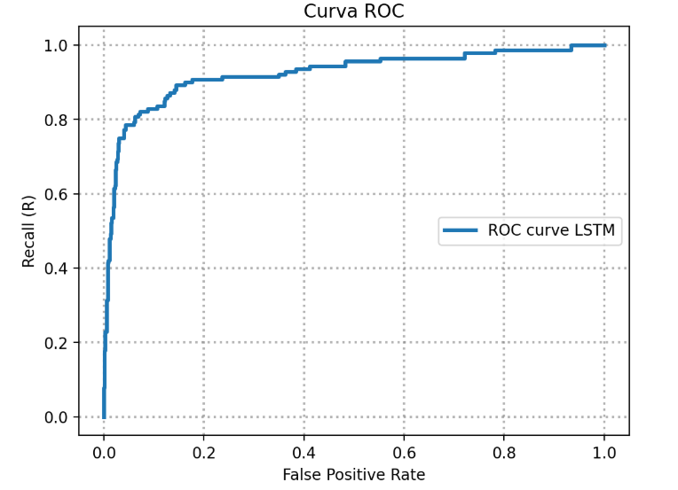
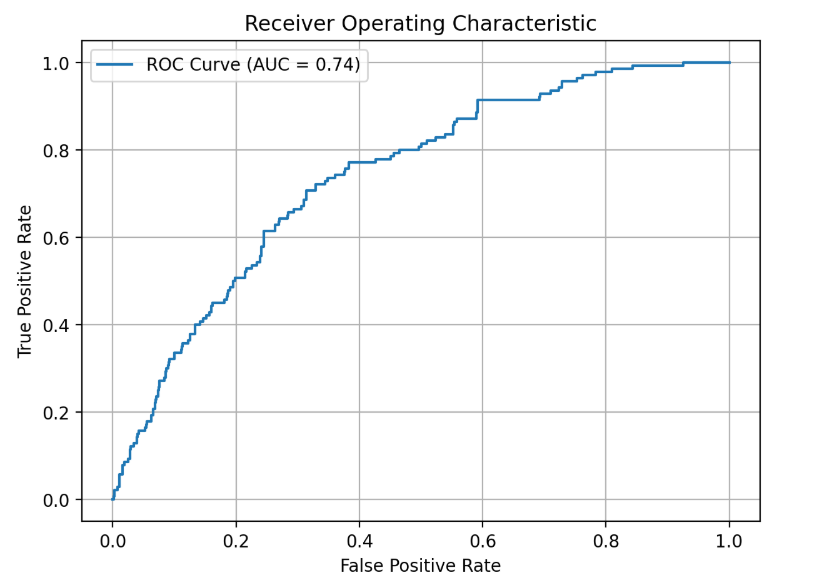
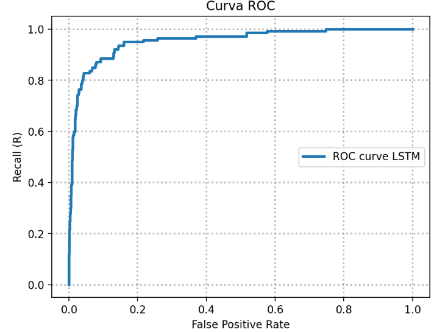

# RNN_setiment_analysis_with_Attention

# RNNs for Sentiment Analysis: With and Without Attention

## Project Description
This project compares two Recurrent Neural Network (RNN) architectures for performing sentiment analysis on financial news data. The two models are:

1. **RNN without Attention**
2. **RNN with Attention Mechanism**

The goal is to classify sentences from the Financial Phrase Bank into two categories: **Positive/Neutral** and **Negative**. The project evaluates the performance of both models using ROC (Receiver Operating Characteristic) curves and compares their AUC (Area Under the Curve) scores.

In this repository, you will find the implementation of both models, along with pre-trained models stored in the `saved_models/` directory for direct usage.

---

## Project Structure
- [`RNN_Sentiment_Analysis.ipynb`](./RNNs_Sentiment_Analysis.ipynb): Jupyter Notebook for training and evaluating the RNN without attention.
- [`RNN_Attention_Sentiment_Analysis.ipynb`](./RNNs_Sentiment_Analysis_with_Attention.ipynb): Jupyter Notebook for training and evaluating the RNN with attention mechanism.
- `saved_models/`: Folder containing the pre-trained models for both architectures.

---

## Setup

### Requirements
- Python 3.7 or higher
- Jupyter Notebook
- PyTorch
- SpaCy

### Usage
1. Clone this repository.
2. Navigate to the project directory.
3. Run the Jupyter Notebooks:

```bash
jupyter notebook RNN_Sentiment_Analysis.ipynb
jupyter notebook RNN_Attention_Sentiment_Analysis.ipynb
```

In the notebooks, there are cells for importing the necessary libraries and loading the datasets.

---

## Dataset Details
The dataset used in this project is the **Financial Phrase Bank**, which contains 4,840 sentences from financial news articles. The sentences are labeled into three categories: **Positive**, **Negative**, and **Neutral**.

For this project, we merged the **Positive** and **Neutral** categories into a single label.

### Dataset Summary
| **Attribute**         | **Description**                                      |
|-----------------------|------------------------------------------------------|
| Dataset Name          | Financial Phrase Bank                               |
| Number of Sentences   | 4,840                                                |
| Categories            | Positive/Neutral, Negative                          |
| Source                | [Financial Phrase Bank](https://www.researchgate.net/profile/Pekka-Malo/publication/251231364_FinancialPhraseBank-v10/data/0c96051eee4fb1d56e000000/FinancialPhraseBank-v10.zip) |

---

## Model Description 1: RNN without Attention

The first model is a standard **RNN with LSTM cells**. The model takes sequences of word embeddings as input and predicts the sentiment label based on the LSTM's final state.

### Model Architecture
| Layer Type          | Output Shape | Activation Function |
|---------------------|--------------|---------------------|
| LSTM Layer          | (batch_size, seq_len, hidden_dim) | - |
| Dropout Layer       | (batch_size, hidden_dim) | - |
| Fully Connected Layer | (batch_size, output_size) | LogSoftmax |

### Training Process
1. **Data Preprocessing**:
   - Text cleaning and tokenization using SpaCy.
   - Normalization of sentence lengths by adding junk tokens.

2. **Loss Function**:
   - Negative Log Likelihood Loss (NLLLoss).

3. **Optimizer**:
   - Adam optimizer with a learning rate of 0.0005.

### Results
The ROC curve obtained for this model is shown in the image below.



The **AUC for RNN without Attention** is 0.92, which is a pretty good result.

### Additional part: MLP Classifier Using Mean Embeddings
In addition to the LSTM-based RNN, we conducted an experiment using an MLP classifier that predicts the sentiment label based on the **mean of the word embeddings** of each sentence. The MLP architecture consists of three layers:

| Layer Type          | Output Shape | Activation Function |
|---------------------|--------------|---------------------|
| Fully Connected 1   | 10           | ReLU                |
| Dropout Layer       | -            | -                   |
| Fully Connected 2   | 5            | ReLU                |
| Fully Connected 3   | 2            | LogSoftmax          |

The MLP model achieved a test accuracy of 87% and an AUC-ROC score of 0.76. The ROC curve is shown below.



As expected. The result is much poorer than the one we got for the RNN model.

---

## Model Description 2: RNN with Attention

The second model incorporates an **attention mechanism** to improve performance. The attention mechanism allows the model to focus on specific parts of the input sequence when making predictions.

### Model Architecture
| Layer Type          | Output Shape | Activation Function |
|---------------------|--------------|---------------------|
| LSTM Layer          | (batch_size, seq_len, hidden_dim) | - |
| Attention Mechanism | (batch_size, hidden_dim) | Tanh |
| Dropout Layer       | (batch_size, hidden_dim) | - |
| Fully Connected Layer | (batch_size, output_size) | LogSoftmax |

### Training Process
1. **Data Preprocessing**:
   - Text cleaning and tokenization using SpaCy.
   - Normalization of sentence lengths by adding junk tokens.

2. **Loss Function**:
   - Negative Log Likelihood Loss (NLLLoss).

3. **Optimizer**:
   - Adam optimizer with a learning rate of 0.0005.

### Results
The ROC curve obtained for this model with Attention is shown in the image below.



The **AUC for RNN without Attention** is 0.95.
---

## Results and Comparison
All models were evaluated on the test set using the **ROC Curve** and **AUC Score**. 

- **AUC for RNN without Attention**: 0.92
- **AUC for MLP model**: 0.73
- **AUC for RNN with Attention**: 0.95

Observing this results, the conclusion is straigh-forward: The MLP classifier does not perform well at all, as could be initially expected, and as for the RNN models, by adding the attention mechanism, the performance improves.

---

## Acknowledgments
This project was carried out as part of the **Machine Learning for Health Master's Program** at **Carlos III University of Madrid**.

In collaboration with:
- [Juan Muñoz Villalón](https://www.linkedin.com/in/juan-munoz-villalon/)
- [Elena Almagro Azor](https://www.linkedin.com/in/elena-almagro-azor-a06942217/)
- [Mario Golbano Corzo](https://www.linkedin.com/in/mario-golbano-corzo/)
